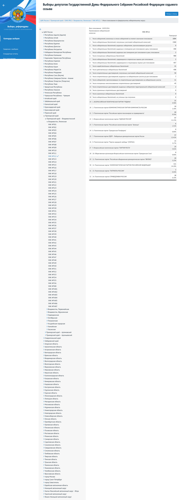
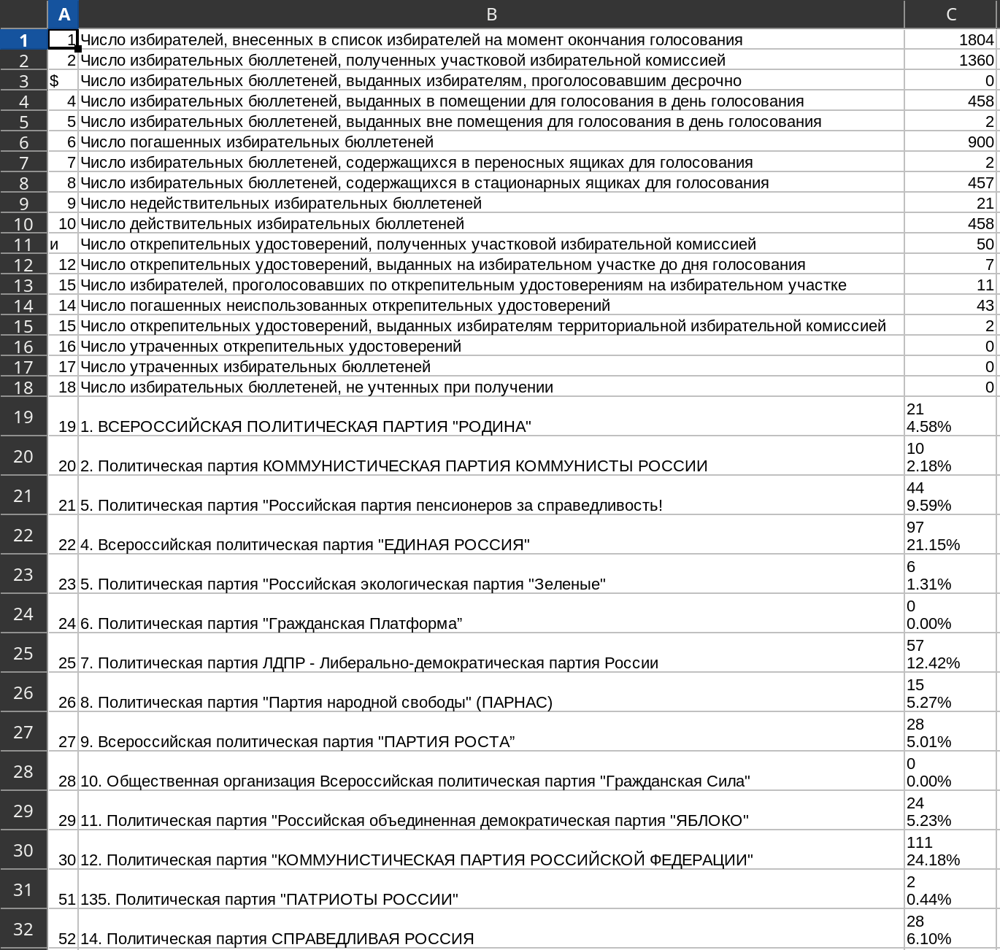

# OCR-Vote

> You can't always get what you want, but if you try sometime... (Rolling Stones)

Proof-of-concept of successful parsing of voting tables.

## Example of work
- Input

- Output


## Steps
1. Make [full screenshots of pages](https://jonathanmh.com/taking-full-page-screenshots-headless-chrome/)
2. Put them into `input` folder
3. Build Docker container with `docker build -f Dockerfile -t ocr-vote:latest .`
4. Run with command
```bash
docker run -it \
    --entrypoint /root/ocr-vote/batch.sh \
    -v $(pwd)/input:/root/ocr-vote/input \
    -v $(pwd)/processed:/root/ocr-vote/processed \
    -v $(pwd)/result:/root/ocr-vote/result \
        ocr-vote:latest \
        input
```

## Example of single-file usage
```bash
docker run -it \
    -v $(pwd)/input:/root/ocr-vote/input \
    -v $(pwd)/processed:/root/ocr-vote/processed \
    -v $(pwd)/result:/root/ocr-vote/result \
        ocr-vote:latest \
        example.png
```

## Troubleshooting
- Change SCALE parameters in the problem script
- Change [psm-parameter](https://github.com/tesseract-ocr/tesseract/issues/434) of Tesseract (most important)
- Change lang according to tessdata dir content
- Change preprocessing script

## Cudos
- https://github.com/eihli/image-table-ocr